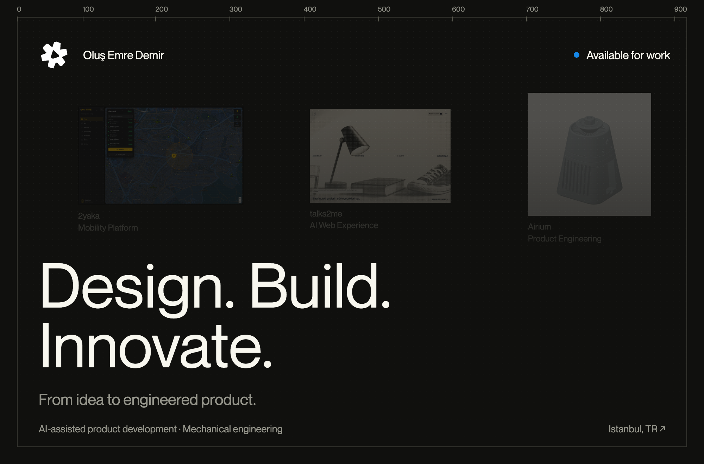
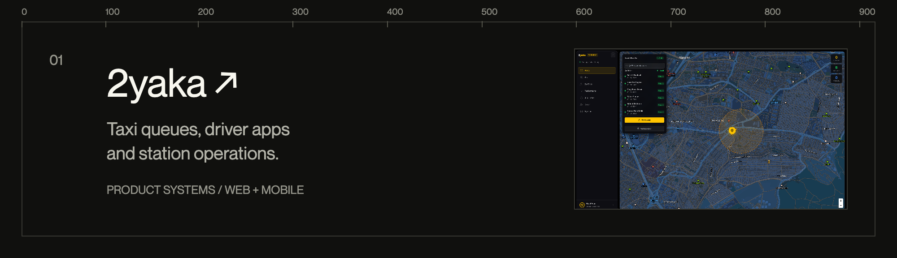
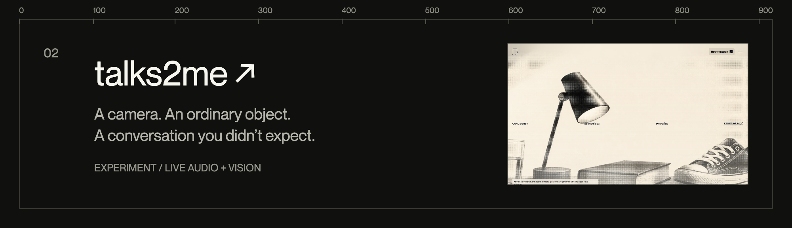
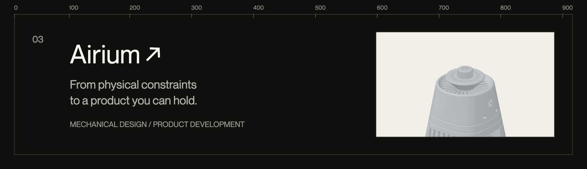
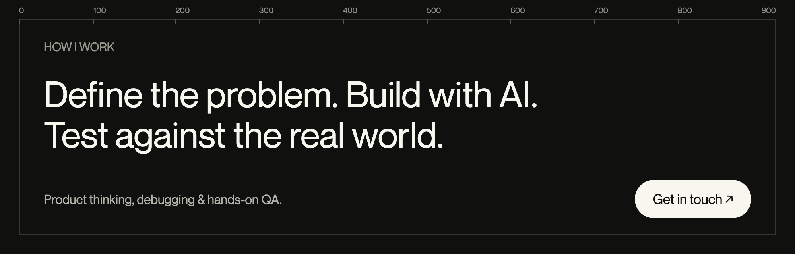

<a href="https://www.olusemre.dev/en">
  <picture>
    <source media="(max-width: 600px)" srcset="assets/hero-mobile.png">
    
  </picture>
</a>

<a href="https://www.olusemre.dev/en/works/2yaka">
  <picture>
    <source media="(max-width: 600px)" srcset="assets/project-2yaka-mobile.png">
    
  </picture>
</a>

<a href="https://www.olusemre.dev/en/works/talks2me">
  <picture>
    <source media="(max-width: 600px)" srcset="assets/project-talks2me-mobile.png">
    
  </picture>
</a>

<a href="https://www.olusemre.dev/en/works/airium">
  <picture>
    <source media="(max-width: 600px)" srcset="assets/project-airium-mobile.png">
    
  </picture>
</a>

<a href="mailto:olusemredemir@gmail.com">
  <picture>
    <source media="(max-width: 600px)" srcset="assets/contact-mobile.png">
    
  </picture>
</a>

[Portfolio](https://www.olusemre.dev/en) · [LinkedIn](https://www.linkedin.com/in/olusemre/) · [Email](mailto:olusemredemir@gmail.com)

About this work &amp; public activity

I'm Oluş, a mechanical engineering student in Istanbul. I use AI tools to develop products, work through product decisions, debug problems, and test real user flows.

The projects above link to case studies; not all source code is public. Below is one recent owner-authored commit per public project, from its default branch. The profile repository, forks, and archived repositories are excluded. This section changes only when the public source data changes.

<!-- activity:start -->
<ul>
<li><code>2026-03-27</code> · <a href="https://github.com/t0ttora/intel/commit/d0574c28f2e3f33aee68cf3c50c994723fcd67e0">intel — fix: query pipeline — Qdrant-first retrieval for semantic relevance over PG recency</a></li>
<li><code>2026-02-26</code> · <a href="https://github.com/t0ttora/yuses/commit/0d70c2ac213fa667e877d9dba759b829801ac6f1">yuses — Create static.yml</a></li>
<li><code>2025-12-15</code> · <a href="https://github.com/t0ttora/canti/commit/34091d7a3d04ec28f1338dc4c8ee5dacd2e9d0a4">canti — Initial commit</a></li>
</ul>
<!-- activity:end -->

