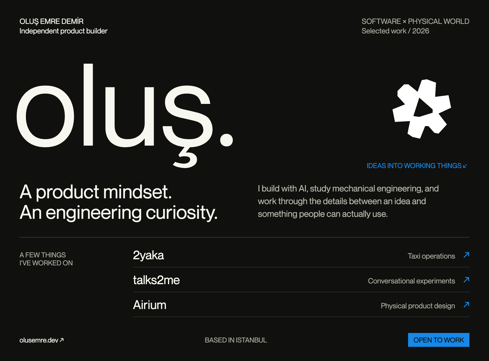

<a href="https://www.olusemre.dev/en/works">
  <picture>
    <source media="(max-width: 600px)" srcset="assets/profile-mobile.png">
    
  </picture>
</a>

  <a href="https://www.olusemre.dev/en/works/2yaka">2yaka ↗</a> &nbsp; · &nbsp;
  <a href="https://www.olusemre.dev/en/works/talks2me">talks2me ↗</a> &nbsp; · &nbsp;
  <a href="https://www.olusemre.dev/en/works/airium">Airium ↗</a> &nbsp; · &nbsp;
  <a href="https://www.linkedin.com/in/olusemre/">LinkedIn</a> &nbsp; · &nbsp;
  <a href="mailto:olusemredemir@gmail.com">Get in touch</a>

About the work / public activity

I'm Oluş, a mechanical engineering student in Istanbul. I use AI tools to develop products, investigate problems, and test real user flows.

- **[2yaka](https://www.olusemre.dev/en/works/2yaka)** — taxi queues, driver apps, and station operations.
- **[talks2me](https://www.olusemre.dev/en/works/talks2me)** — conversations with objects through live audio and vision.
- **[Airium](https://www.olusemre.dev/en/works/airium)** — mechanical design and physical product development.

Some project source code is private. Below is one recent owner-authored commit per public project, from its default branch. Synced only when source data changes; this profile, forks, and archived repositories are excluded.

<!-- activity:start -->
<ul>
<li><code>2026-03-27</code> · <a href="https://github.com/t0ttora/intel/commit/d0574c28f2e3f33aee68cf3c50c994723fcd67e0">intel — fix: query pipeline — Qdrant-first retrieval for semantic relevance over PG recency</a></li>
<li><code>2026-02-26</code> · <a href="https://github.com/t0ttora/yuses/commit/0d70c2ac213fa667e877d9dba759b829801ac6f1">yuses — Create static.yml</a></li>
<li><code>2025-12-15</code> · <a href="https://github.com/t0ttora/canti/commit/34091d7a3d04ec28f1338dc4c8ee5dacd2e9d0a4">canti — Initial commit</a></li>
</ul>
<!-- activity:end -->

